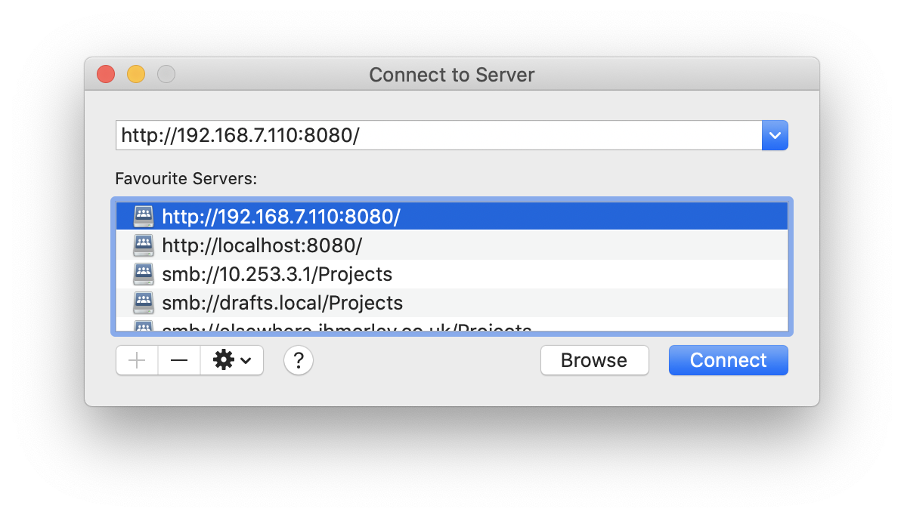
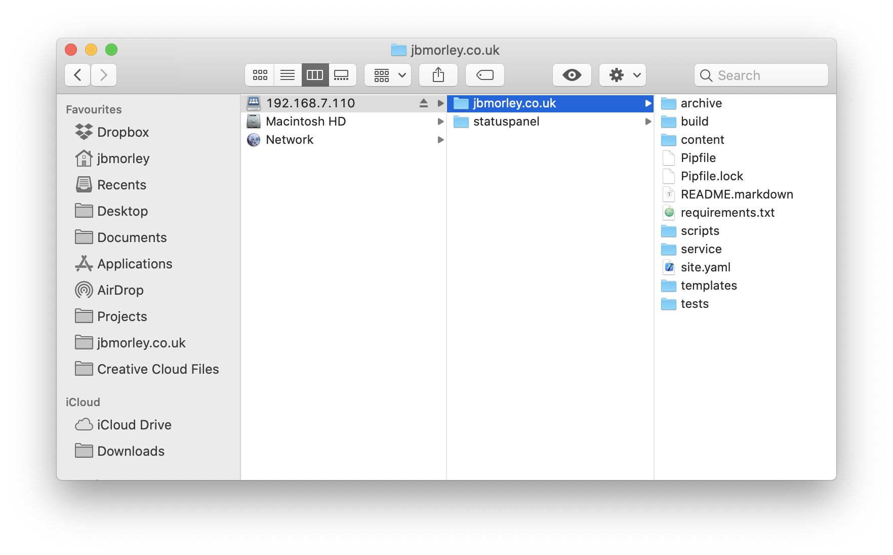

# Compute

iOS application for using a Raspberry Pi as a compute module

_Compute is no longer under active development._

## Summary

This project is intended to build on previous work and guides that set about using the [Raspberry Pi](https://www.raspberrypi.org) as an iPad accessory, connecting it over USB-C and then using VNC and SSH to control the Pi. While these solutions are great if your goal is to use a Raspberry Pi, they don't really allow the two systems to interoperate; the iPad essentially acts as a dumb terminal for the Pi. Compute tries to bridge that gap.

Compute uses a WebDAV server to allow the Raspberry Pi to mount the files on the iPad and act on the iPad, making for a much greater seamless integration between the two systems. Ultimately, the goal is to automatically launch the app and configure the connection when the Raspberry Pi is plugged in to the iPad.

## Status

This project is pretty new, so there's only a limited set of things working right now. It's provably enough to bring some simple utility, but certainly needs a little :

- WebDAV server implementation for iOS (built using the wonderful [CocoaHTTPServer](https://github.com/robbiehanson/CocoaHTTPServer)).
- Ability to select folders to share over the WebDAV server from other file providers (e.g., iCloud Drive, [Working Copy](https://workingcopyapp.com), etc)

Check out the [GitHub Issues](https://github.com/jbmorley/compute/issues) to learn about any known issues, and future ideas and plans.

## Getting Started

There are a few steps to follow to make use of the app right now:

1. You'll probably want a keyboard for your iPad; the new [Magic Keyboard](https://www.apple.com/ipad-keyboards/) is great.

2. If you're planning on carrying around your Raspberry Pi then some form of case is also a good idea. Heatsink cases seem to be getting a lot of traction these days and Pimoroni has [some wonderful options](https://shop.pimoroni.com/products/aluminium-heatsink-case-for-raspberry-pi-4) (which you can find on [SparkFun](https://www.sparkfun.com/products/15896) in the US), and if you want to spend a bit more money, Akasa also have [some elegant cases](http://www.akasa.com.tw/update.php?tpl=product/product.list.tpl&type=Fanless%20Chassis&type_sub=Fanless%20Raspberry%20pi).

3. Clone the repository and submodules:

   ```bash
   git clone git@github.com:jbmorley/compute.git
   cd compute
   git submodule update --init
   ```

4. Open 'Compute.xcodeproj' with the latest [Xcode](https://developer.apple.com/xcode/). Compile, and run.

5. To keep things simple, it's a good idea to check that the WebDAV share is working by mounting it using your using your Mac:

   1. With Finder active, type ⌘K (or select Go > Connect to Server... in the menu).

   2. Enter the address displayed on your iOS app, and click 'Connect'. For example,
      
      
   3. If everything's working well, you should see a new mounted volume on your Mac, and you shoudl be able to navigate this in Finder:
      
      
   4. Once you've confirmed you're able to access your iPads file system using WebDAV, set up your Raspberry Pi to host a network over USB-C as described [here](https://magpi.raspberrypi.org/articles/connect-raspberry-pi-4-to-ipad-pro-with-a-usb-c-cable).

   5. Set up the Raspberry Pi to connect to your iOS device over WebDAV:

      1. Create a new mount point:

         ```bash
         sudo mkdir /mnt/webdav
         ```

      2. Add the following entry to `/etc/fstab`:

         ```
         # iPad
         http://10.55.0.5:8080/ /mnt/webdav davfs _netdev,noauto,user,uid=pi,gid=pi 0 0
         ```

      3. Start the mount:

         ```bash
         sudo mount /mnt/webdav
         ```
         
      4. Install and run the Bluetooth keep-alive server. Unforutnately this requires dropping back to an earlier version of Node.js to address some dependency incompatibilities (see https://github.com/noble/bleno/issues/440):
      
         ```bash
         sudo npm install -g n
         sudo n 8.9.0
         ```
      
         Once you've done this, clone the repository to the Raspberry Pi, and run the server:
      
         ```bash
         git clone git@github.com:jbmorley/compute.git
         cd compute
         git submodule update --init
         cd raspberry-pi/bluetooth-server
         sudo node index.js
         ```

## Raspberry Pi Setup

Until we provide a pre-built image for the Raspberry Pi, it's necessary to perform a few steps to correctly configure your Raspberry Pi. This will install the required dependenices, a number of tools suited to development, and set up the USB-C networking and bluetooth server:

- Clone the repository:

  ```bash
  git clone git@github.com:jbmorley/compute.git
  cd compute
  git submodule update --init
  ```

- Install the required dependencies and configuration (this uses Ansible under the hood):

  ```bash
  cd raspberry-pi/compute-tools
  ./setup.sh
  ```

## Background

There are some great guides which describe the process of configuring a Raspberry Pi to use the iPad's USB-C connection for networking:

- [Use Raspberry Pi 4 USB-C data connection to connect with iPad Pro](https://magpi.raspberrypi.org/articles/connect-raspberry-pi-4-to-ipad-pro-with-a-usb-c-cable) –  a great guide by [The MagPi](https://magpi.raspberrypi.org/)
- [Pi4 USB-C Gadget](https://www.hardill.me.uk/wordpress/2019/11/02/pi4-usb-c-gadget/)

## Utilities

Utilities for connecting directly to, and managing, your Raspberry Pi:

- [VNC Viewer for iOS](https://www.realvnc.com/en/connect/download/viewer/ios/)
- [Blink Shell](https://blink.sh)
- [Termius for iOS](https://termius.com/ios)

## Alternatives

The goal of Compute is to bring a containerised development environment to the iPad, in the same way that Docker might be used for a build phase both in CI solutions, and locally. In an ideal world, this development environment would be available natively within iOS through a virtualisation layer. There are some projects which attempt to do exactly this, from as far back as 2018:

* [UTM](https://getutm.app) – QEMU-based virtualisation
  * [Installing ArchLinux on an iPad](https://www.youtube.com/watch?app=desktop&v=fsDEei0XS94) (YouTube)
  * [New app to let you run Windows 10 on your iPhone](https://www.windowslatest.com/2020/02/22/iphone-ipad-windows-10/)
* [iSH](https://ish.app) – Linux shell for iOS
  * [How to Get a Linux Shell on iPad or iPhone with iSH](https://osxdaily.com/2018/12/11/ish-linux-shell-ios/)
* [iPad Linux](https://ipadlinux.org) – lists many of the approaches to getting Linux running on an iPad, from virtualisation through to jailbreaking

